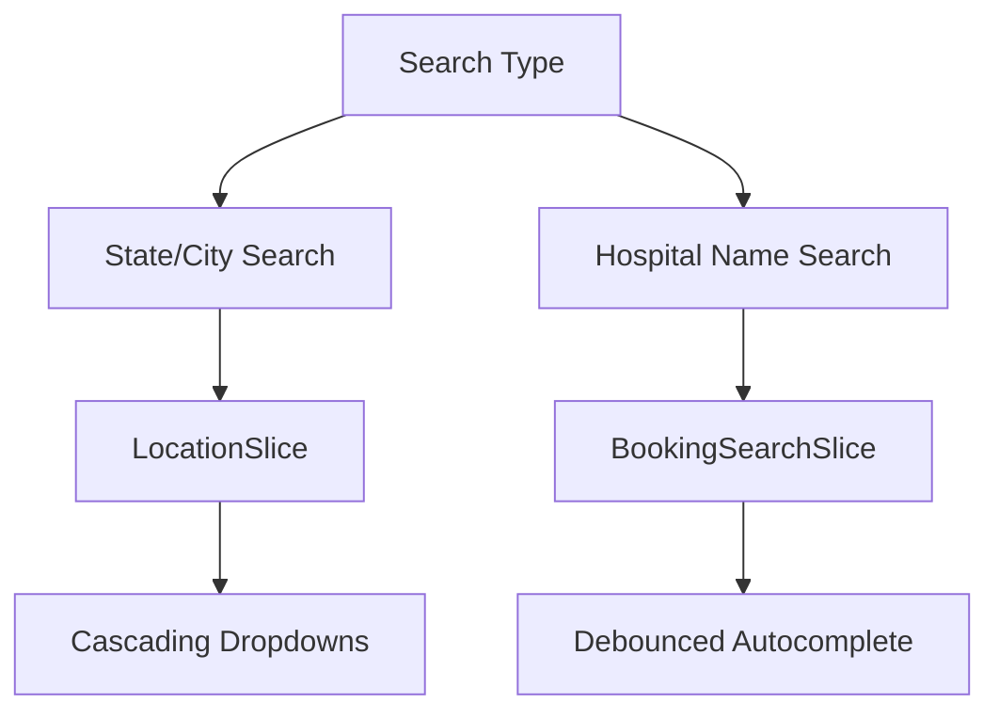

Here's a comprehensive `README.md` for your Medify project based on the code you've shared:

```markdown
# Medify - Medical Center Finder 🏥

A modern healthcare platform for finding medical centers, booking appointments, and managing healthcare needs.

 

## Features ✨

- **Hospital Search** by state/city or name
- **Appointment Management** with local storage persistence
- **Responsive Design** for all devices
- **Interactive UI** with:
  - Filterable hospital listings
  - Booking system
  - FAQ accordions
  - Specialist carousels
- **Redux-Powered** state management

## Tech Stack 🛠️

| Category       | Technologies                          |
|----------------|---------------------------------------|
| Core           | React 19, Vite 6                      |
| State Management | Redux Toolkit, React-Redux            |
| Routing        | React Router v6                       |
| UI Framework   | Material-UI (MUI) v7 + Emotion        |
| Additional Libs| Swiper (carousels), react-loading-skeleton |

## Project Structure 📂

```
src/
├── components/
│   ├── Button/
│   ├── Logo/
│   ├── Navbar/
│   │   ├── NavbarBanner.jsx
│   │   ├── NavbarBookingsSearchBar.jsx
│   │   ├── NavbarMenu.jsx
│   │   ├── NavbarSearchBar.jsx
│   │   └── StyledComponents.jsx
│   └── (other shared components)
├── features/
│   ├── bookingSearchSlice.jsx
│   ├── fetchedAppointmentSlice.jsx
│   └── locationSlice.jsx
├── pages/
│   ├── BookingsPage.jsx
│   ├── Homepage.jsx
│   └── HospitalsPage.jsx
├── templates/
│   ├── BlogSection.jsx
│   ├── FAQSection.jsx
│   ├── FamilySection.jsx
│   ├── FindBySpecilization.jsx
│   ├── Footer.jsx
│   ├── HospitalBookings.jsx
│   ├── HospitalListingSection.jsx
│   ├── LandingSection.jsx
│   ├── MobileAppSection.jsx
│   ├── PatientCaringSection.jsx
│   └── SpecialistSection.jsx
└── store.js
```

## Key Components 🔍

### 1. Navigation System
- **Smart Navbar** that:
  - Transforms on scroll
  - Switches between search modes
  - Responsive drawer menu
- **Context-Managed** tabs system

### 2. Search Systems


### 3. Booking Management
- LocalStorage persistence
- Filterable appointment list
- Responsive card layouts

## Installation ⚙️

1. Clone repo:
   ```bash
   git clone https://github.com/psbcg433/medify.git
   ```
2. Install dependencies:
   ```bash
   npm install
   ```
3. Run development server:
   ```bash
   npm run dev
   ```

## Scripts 🖥️

| Command        | Description                     |
|----------------|---------------------------------|
| `npm run dev`  | Start Vite dev server          |
| `npm run build`| Production build               |
| `npm run lint` | Run ESLint                     |

## Design System 🎨

- **Primary Colors**: Blue gradient (`#2AA7FF → #0C8CE5`)
- **Typography**: Poppins (headers), Ubuntu (body)
- **Spacing**: 8px baseline grid
- **Breakpoints**:
  ```js
  {
    xs: 0,    // Phone
    sm: 600,  // Tablet
    md: 900,  // Small desktop
    lg: 1200  // Large desktop
  }
  ```

## Optimization Highlights 🚀

- **Lazy-loaded** routes and components
- **Debounced** search inputs
- **Memoized** selectors in Redux
- **Responsive images** with proper sizing

---

