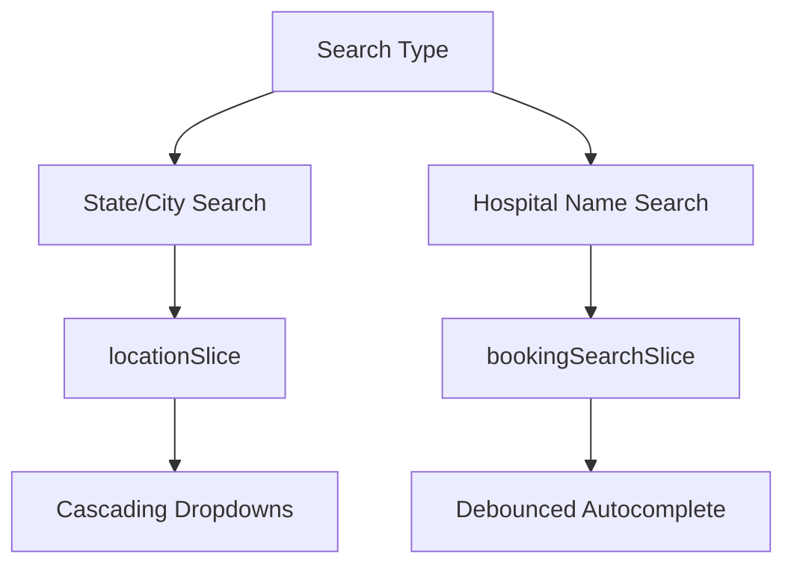

# 🏥 Medify - Medical Center Finder

**Medify** is a modern healthcare platform designed to help users easily find medical centers, book appointments, and manage their healthcare needs through an intuitive, responsive interface.


---

## ✨ Features

- 🔍 **Hospital Search** by state, city, or name
- 📅 **Appointment Booking & Management** (with localStorage persistence)
- 💡 **Interactive UI Components**:
  - Filterable hospital listings
  - FAQ accordion sections
  - Specialist carousels
- 📱 **Responsive Design** optimized for all device types
- ⚛️ **Redux-Powered** state management for consistency and scalability

---

## 🛠️ Tech Stack

| Category         | Technologies                             |
|------------------|-------------------------------------------|
| Core             | React 19, Vite 6                          |
| State Management | Redux Toolkit, React-Redux                |
| Routing          | React Router v6                           |
| UI Framework     | Material-UI (MUI) v7 + Emotion CSS-in-JS |
| Additional Libs  | Swiper (carousels), react-loading-skeleton |

---


---

## 🔍 Key Components

### 1. Navigation System
- **Responsive Navbar** with scroll-based transformations
- Tab switching between search modes (location-based & hospital-name-based)
- Mobile drawer integration
- Powered by **React Context API**

### 2. Smart Search System



### 3. Booking Management
- Uses **localStorage** for persistence
- Filterable and responsive appointment card layouts

---

## ⚙️ Getting Started

### 1. Clone the repository:
```bash
git clone https://github.com/psbcg433/medify.git
```

### 2. Install dependencies:
```bash
npm install
```

### 3. Start the development server:
```bash
npm run dev
```

---

## 🖥️ Available Scripts

| Script            | Purpose                             |
|-------------------|-------------------------------------|
| `npm run dev`     | Run the development server          |
| `npm run build`   | Create a production build           |
| `npm run lint`    | Run ESLint for code quality         |

---

## 🎨 Design System

- **Primary Colors**: Blue Gradient (`#2AA7FF → #0C8CE5`)
- **Typography**:
  - `Poppins` (Headings)
  - `Ubuntu` (Body)
- **Spacing**: Based on an 8px grid system
- **Breakpoints**:
```js
{
  xs: 0,     // Mobile
  sm: 600,   // Tablets
  md: 900,   // Small desktops
  lg: 1200   // Large desktops
}
```

---

## 🚀 Performance Optimizations

- **Lazy-loaded** routes and heavy components
- **Debounced** search input fields
- **Memoized** Redux selectors
- Optimized for **responsive rendering** across devices

---


> Made with ❤️psbcg433 for better healthcare accessibility.